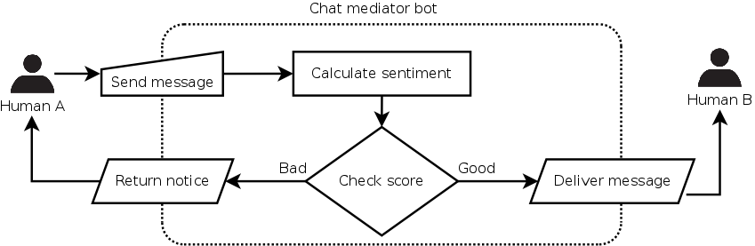
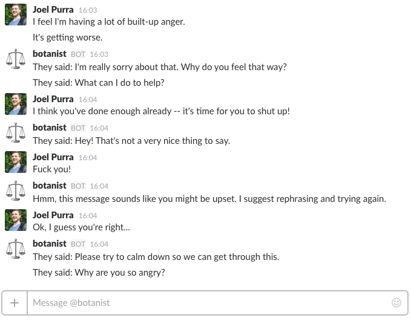
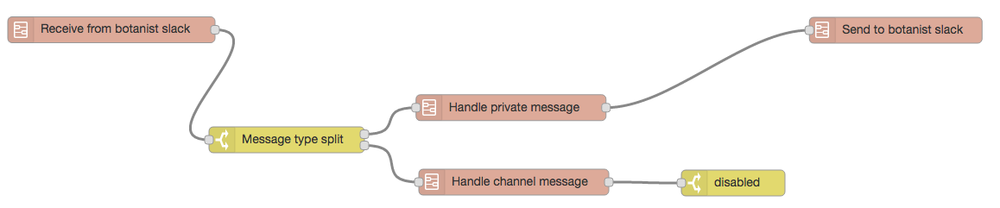

# [Conversation Augmentation: Chat Mediator Bot](https://github.com/joelpurra/conversation-augmentation-chat-mediator-bot)

Reduce anger and improve two-way human-to-human conversations with the help of a mediating/moderating chatbot. This particular bot blocks angry messages which have a bad [sentiment score](https://en.wikipedia.org/wiki/Sentiment_analysis) from being delivered to the other chat participant.

See [conversationaugmentation.com](http://conversationaugmentation.com/) for more information!


## Augmentation by encouraging more positive messages

[](docs/flowchart/Chat mediator bot.png)

- In a person-to-person conversation, each message is inspected by the mediating chatbot before being passed on.
- Each message is given a [sentiment score](https://en.wikipedia.org/wiki/Sentiment_analysis) using a [word-by-word analysis](https://github.com/thisandagain/sentiment).
- A negative score indicates that the message is aggressive.
- Very aggressive messages are blocked by the mediator, and never seen by the other chat participant.
- The chat user is instead encouraged to write a nicer message, which would then be delivered.
- This way the most blatant aggressiveness can be avoided, and hopefully slowing down or stopping a downward agressiveness spiral.

Here is an example conversation between me (Joel Purra) a friend ("they"), in a chat session through a mediator bot called @botanist. The other human's responses are prefixed with "they said." One of my messages gets blocked with a notice from @botanist.

[](docs/screenshots/Screen Shot 2016-11-20 at 16.06.03.png)


## Installation

In order to run the chatbot you need [Node.js](https://nodejs.org/en/), a new [Slack bot user token](https://api.slack.com/bot-users), and a [MongoDB](https://www.mongodb.com/) server.

```bash
# Install dependencies.
npm install

# Run and open the chatbot server and UI/editor.
npm run --silent start
open http://127.0.0.1:1880/

# Now use the UI to configure:
#  - your slack bot token
#  - your mongodb connection

# Chat with your bot through slack!
```


## Have a civilized conversation

- Open a private window with your bot
- You can `start session demo`
- Let someone else `join session demo`
- Chat with reduced aggressiveness!
  - Most messages are let through.
  - Messages with "aggressive" words, such as curse words are blocked.


## Development

All bot development was made using the visual editor in [node-red](https://nodered.org/) using nodes from the [node-red-contrib-chatbot](https://github.com/guidone/node-red-contrib-chatbot) plugin/addon. It's all running locally, using the commands above, and it's *really, really, really* easy to improve the bot without programming. Here's an example of "visual code" in the main flow:

[](docs/screenshots/Screen Shot 2016-11-20 at 15.24.22.png)


## Story

Created at the [Bothack.berlin](http://bothack.berlin/) hackathon in at the [TLGG](https://www.tlgg.de/) offices 2016-11-18--20. Thanks to Karolin Rühlmann, Liron Tocker, all others who helped out, as well as the hackathon organizers.

---

Copyright &copy; 2016 [Joel Purra](https://joelpurra.com/). All rights reserved.

When using the [conversation-augmentation-chat-mediator-bot source code](https://github.com/joelpurra/conversation-augmentation-chat-mediator-bot), comply with the [GNU Affero General Public License 3.0 (AGPL-3.0)](https://en.wikipedia.org/wiki/Affero_General_Public_License).
